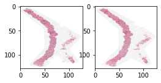
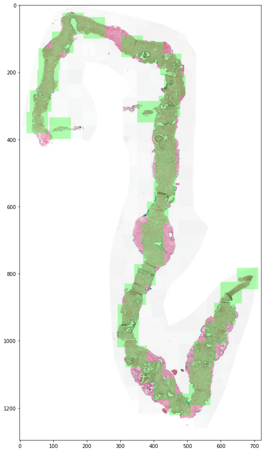
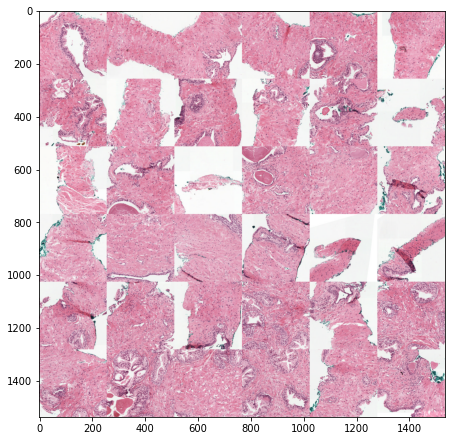

# PANDA Challenge
AI powered Prostate cancer ISUP grading. Team **rähmä.ai** solution for the [Prostate cANcer graDe Assessment (PANDA) Challenge](https://www.kaggle.com/c/prostate-cancer-grade-assessment). We ranked 24th (top 3%) in the competition. The models included in this repository get **0.930** QWK in the private test set and **0.904** QWK in the public test set.

## Team rähmä.ai

- [Mikko Tukiainen](https://github.com/mjkvaak)
- [Joni Juvonen](https://github.com/jpjuvo)
- [Antti Karlsson](https://github.com/AnttiKarlsson)

-----------------------------------------------------

## Installation

1. **Download [PANDA dataset](https://www.kaggle.com/c/prostate-cancer-grade-assessment/data)**

2. **Clone this repository.**

3. **cd into cloned repository and install dependencies:**

```bash
python3 -m venv venv
source venv/bin/activate
pip3 install --upgrade pip
pip3 install -r requirements.txt
```

4. **(Optional) Install ResNeSt pre-trained models package**

```
pip install git+https://github.com/zhanghang1989/ResNeSt
```

## Preprocessing

1. **Find all serial section replicates by running [Detect_serial_sections.ipynb](./preprocessing/Detect_serial_sections.ipynb)**

The training data contains near duplicate slides which come from serial sections. The same tissue sample is sliced multiple times but these are essentially different parts and not duplicate although they may look similar.



Replicate slides of the same tissue sample are physically different and shouldn't be removed. However, they can be very similar to each other and they have same labels so this is problematic for evaluation. Replicates shouldn't be placed in same cross-validation folds to avoid sample memorization.

2. **Sample tissue parts of the training data ot generate tile training sets.**

- [Level 1 6x6 256-tiles from 256 slide size](./ptrprocessing/tissue_mosaic_generation_lvl1_256_6x6_256.ipynb)
- [Level 1 4x6 256-tiles from 384 slide size](./ptrprocessing/tissue_mosaic_generation_lvl1_384_4x6_256.ipynb)
- [Level 1 5x5 299-tiles from 299 slide size](./ptrprocessing/tissue_mosaic_generation_lvl1_299_5x5_299.ipynb)

Our method samples tile images along the tissue skeleton. The first image shows the WSI (whole slide image) with green sampling places and the second image shows the cropped tiles. The Figure below is sampled with 6x6 256-sized tiles using 256 slide size.




## Training

Train using [Train template notebook](./training/Train-template.ipynb).

[Training readme](./training/README.md) has additional instructions.

#### Competition models

We trained our `256`, `299` and `384`  models that we used in the final submission with these scripts (in order).

**256 model**

1. `train_256_ordinal_0.py`
2. `train_256_ordinal_1.py`

[Trained model](https://www.kaggle.com/qitvision/panda-models-256-256-ordinal)

**384 model**

1. `train_384_ordinal_0.py`
2. `train_384_ordinal_1.py`
3. `train_384_ordinal_2.py`

[Trained model](https://www.kaggle.com/qitvision/panda-models-384-256-ordinal)

**299 model**

1. `train_299_0.py`
2. `train_299_1.py`
3. `train_299_2.py`
4. `train_299_3.py`

[Trained model](https://www.kaggle.com/qitvision/jj20200706)

## Inference

Please see our [inference notebook](https://www.kaggle.com/qitvision/panda-r-hm-ai-private-score-0-93) that uses [`256`](https://www.kaggle.com/qitvision/panda-models-256-256-ordinal) and [`384`](https://www.kaggle.com/qitvision/panda-models-384-256-ordinal) models. This scored 0.930 qwk in the private, and
0.904 qwk in the public test sets.

[The one](https://www.kaggle.com/qitvision/jj-2020-07-21-all-models) that we used in the final competition submission scored 0.926 qwk in the private, and 0.907 qwk in the public test sets. 
