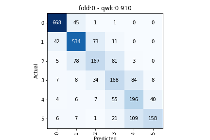
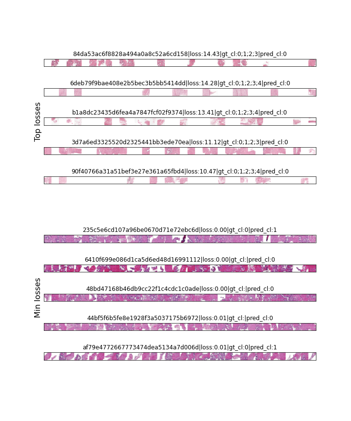

# Training :computer: :fire:

1. **Copy `Train-template` notebook**

Naming convention: E.g. `initials-yyyy-MM-dd-runningIndexPerDay` but this is not forced. Description is also fine. 

2. **Change magic variables :wrench:**

The notebook follows a template but that shouldn't restrict your experiments. If you wan't to use a new model, check how it's done in `model/___init__.py`.

If you wan't to tune transforms, epochs, optimizers, dropout or learning rates, these are all in the **variables** cell. Additionally, the training cell is still exposed for tuning.

3. **Remember to use a unique SAVE_DIR and check data statistics (inverse mean and std) from the data generation notebook**

## Results

The trained models are saved to your SAVE_DIR along with training metadata and evaluation results. The result include class confusion matrices and visualizations of top and lowest losses.

